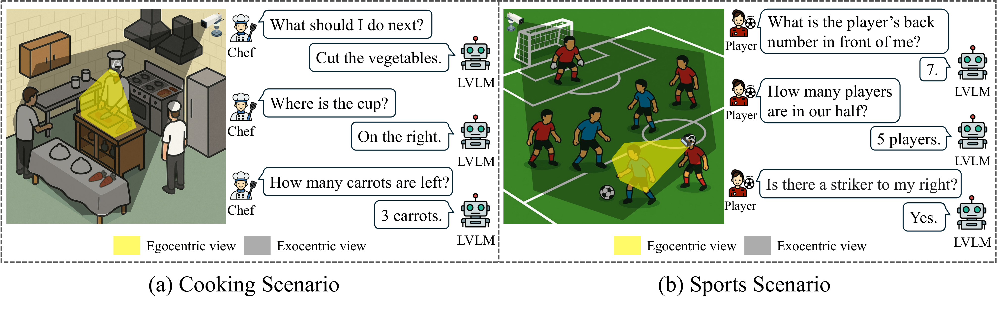
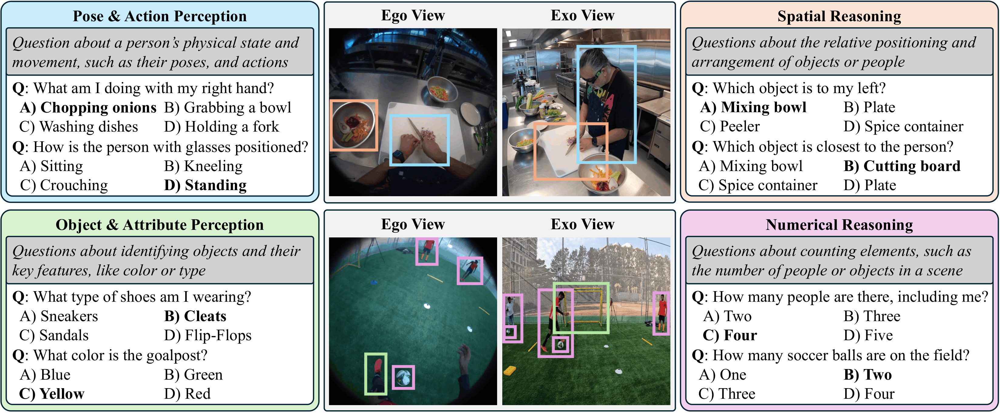
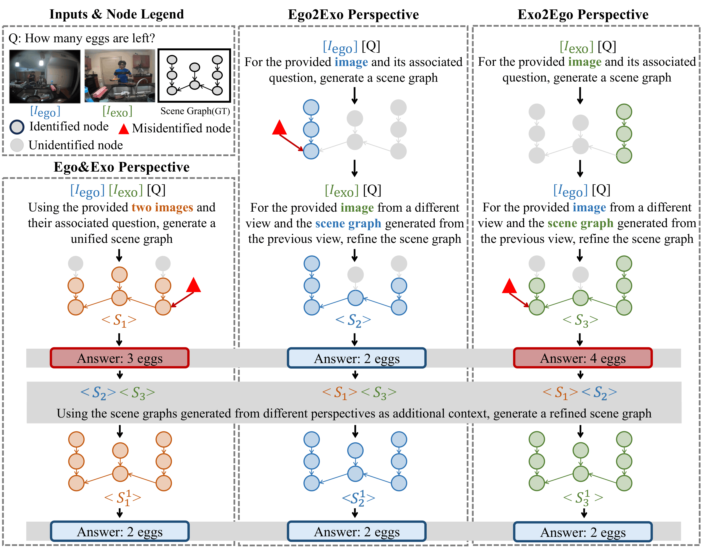

# Towards Comprehensive Scene Understanding: Integrating First and Third-Person Views for LVLMs

<p align="center">
  <b>NeurIPS 2025 Spotlight</b>
</p>

<p align="center">
  <a href="https://arxiv.org/abs/2505.21955">
    
  </a>
  <a href="https://proceedings.neurips.cc/paper_files/paper/2025/hash/1af83ab66b4f07a3f55788e67dab5782-Abstract-Conference.html">
    
  </a>
  <a href="https://huggingface.co/datasets/SNU-ISLAB/E3VQA">
    
  </a>
  <a href="https://huggingface.co/papers/2505.21955">
    
  </a>
</p>

<p align="center">
  
</p>

We study **multi-view scene understanding for large vision-language models (LVLMs)** by combining complementary information from egocentric and exocentric observations.

This repository contains the official implementation of **E3VQA**, a benchmark for evaluating ego–exo scene understanding, and **M3CoT**, a training-free prompting method for integrating information across multiple viewpoints.

---

## 📊 E3VQA Benchmark

**E3VQA (Ego-Exo Expanded Visual Question Answering)** evaluates the ability of LVLMs to understand scenes from synchronized first-person and third-person observations.

<p align="center">
  
</p>

E3VQA covers four aspects of multi-view scene understanding:

- **Pose & Action Perception** — understanding human poses, actions, and interactions
- **Object & Attribute Perception** — identifying objects and their visual attributes
- **Numerical Reasoning** — counting people and objects in a scene
- **Spatial Reasoning** — reasoning about relative positions and spatial relationships

Each sample contains paired ego–exo observations, a multiple-choice question, its answer choices, and viewpoint-aware annotations.

### 🤗 Loading the Dataset

```python
from datasets import load_dataset

dataset = load_dataset("SNU-ISLAB/E3VQA", split="test")
print(dataset[0])
```

---

## 🧠 M3CoT

**M3CoT** is a training-free multi-view prompting method that integrates complementary information across ego and exo viewpoints.

<p align="center">
  
</p>

M3CoT constructs scene representations from multiple perspectives and progressively refines them using information from the other perspective. The resulting representation integrates complementary information into a unified and more complete understanding of the scene for answering the target question.

---

## ⚙️ Evaluation with lmms-eval

Standardized evaluation for **E3VQA** is supported in [lmms-eval](https://github.com/EvolvingLMMs-Lab/lmms-eval).

### Example

```bash
python -m lmms_eval \
  --model qwen2_5_vl \
  --model_args pretrained=Qwen/Qwen2.5-VL-7B-Instruct \
  --tasks e3vqa \
  --batch_size 1
```

### Available Tasks

- `e3vqa`: Full E3VQA benchmark
- `e3vqa_egoexo4d`: Ego-Exo4D subset
- `e3vqa_lemma`: LEMMA subset

The evaluation reports overall accuracy together with category- and perspective-specific accuracies for:

- Pose & Action
- Object & Attribute
- Numerical Reasoning
- Spatial Reasoning

For installation, supported models, and additional evaluation options, see the [lmms-eval repository](https://github.com/EvolvingLMMs-Lab/lmms-eval).

---

## 📖 Citation

Please cite our paper as:

```bibtex
@inproceedings{lee2025towards,
  author = {Lee, Insu and Park, Wooje and Jang, Jaeyun and Noh, Minyoung and Shim, Kyuhong and Shim, Byonghyo},
  booktitle = {Advances in Neural Information Processing Systems},
  doi = {10.52202/085713-0627},
  pages = {18576--18628},
  title = {Towards Comprehensive Scene Understanding: Integrating First and Third-Person Views for LVLMs},
  url = {https://proceedings.neurips.cc/paper_files/paper/2025/file/1af83ab66b4f07a3f55788e67dab5782-Paper-Conference.pdf},
  volume = {38, Main Conference},
  year = {2025}
}
```

---

## 🔎 Related Work

We further study multi-view hallucination in LVLMs in our follow-up work:

**[Revealing Multi-View Hallucination in LVLMs](https://arxiv.org/abs/2603.23934)** — analyzing multi-view hallucination and exploring approaches to mitigate it.
